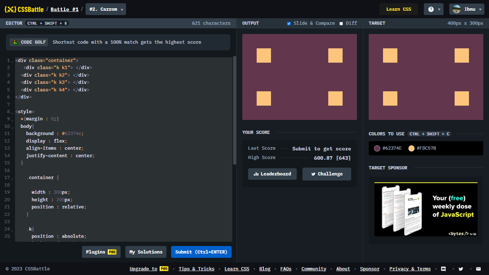

# Battle #2 - Pilot Battle

## #2 - carrom

[Link to the problem](https://cssbattle.dev/play/2)



```html
<div class="container">
   <div class="k k1"> </div>
  <div class="k k2"> </div>
  <div class="k k3"> </div>
  <div class="k k4"> </div>
</div>

<style>
  *{margin : 0;}
  body{
    background : #62374e;
    display : flex;
    align-items : center;
    justify-content : center;
  }

    .container {
     
      width : 300px;
      height : 200px;
      position : relative;
    }

    .k{
      position : absolute;
      background : #fdc57b;
      height : 50px;
      width : 50px;
    }

    .k2{
      right : 0;
    }

    .k3{
      bottom : 0;
    }

    .k4{
      bottom : 0;
      right : 0;
    }
</style>
```
