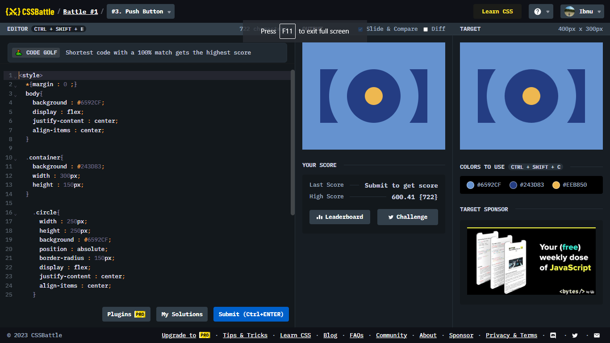

# Battle #1 - Pilot Battle

## #1 - Simple Square

[Link to the problem](https://cssbattle.dev/play/3)



```html
<style>
  *{margin : 0 ;}
  body{
    background : #6592CF;
    display : flex;
    justify-content : center;
    align-items : center;
  }

  .container{
    background : #243D83;
    width : 300px;
    height : 150px;
  }

    .circle{
      width : 250px;
      height : 250px;
      background : #6592CF;
      position : absolute;
      border-radius : 150px;
      display : flex;
      justify-content : center;
      align-items : center;
    }

    .inner-circle{
      width : 50px;
      height : 50px;
      background : #EEB850;
      border-radius : 100%;
      border : 50px solid #243D83;
    }
    
</style>

<div class="container"> </div>

<div class="circle"> 
  <div class="inner-circle"> </div>
</div>
</style>
```
